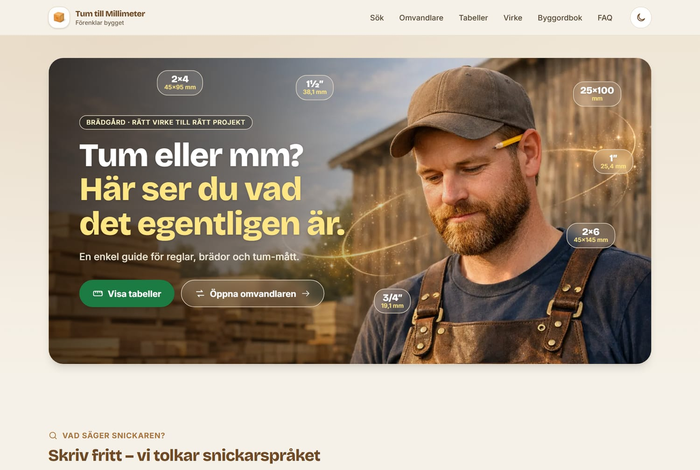
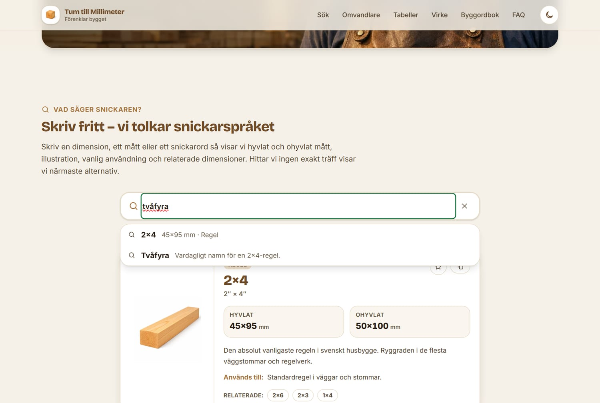
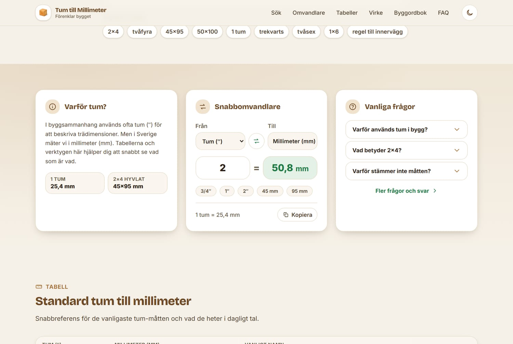
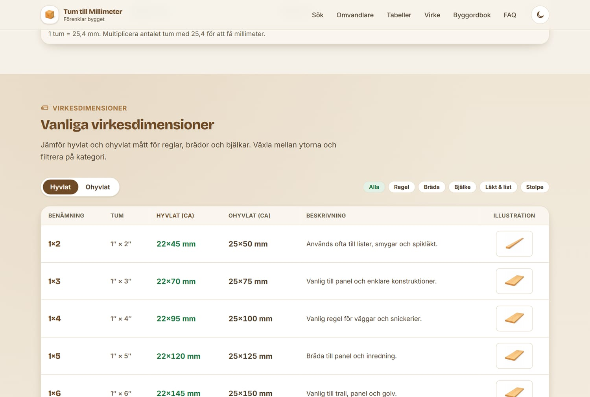
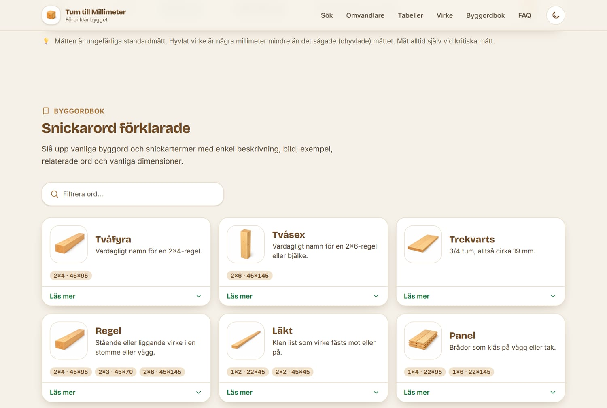
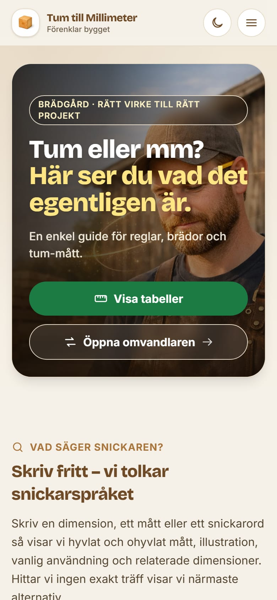

<div align="center">

# 🪵 Tum till Millimeter

**Sveriges enkla guide för virkesdimensioner, tum-mått och byggtermer.**

[](https://vindrosen.github.io/tum-till-millimeter/)
[](https://nextjs.org)
[](https://www.typescriptlang.org)
[](https://tailwindcss.com)

### 👉 [Öppna sajten: vindrosen.github.io/tum-till-millimeter](https://vindrosen.github.io/tum-till-millimeter/)



</div>

---

Byggd för hemmafixare, snickare och alla som stöter på gamla tum-beteckningar som **2×4**, **2×6**
eller **1×6** och snabbt vill veta vad de motsvarar i millimeter.

> "Kan du hämta en tvåfyra?" → 2×4 = **45 × 95 mm** hyvlat, **50 × 100 mm** ohyvlat.

---

## ✨ Funktioner

| | |
| --- | --- |
| 🔎 **Vad säger snickaren?** – fritextsökning som tolkar snickarspråk (`2x4`, `tvåfyra`, `45x95`, `1 tum`, `trekvarts`, `regel till innervägg`). Visar hyvlat/ohyvlat mått, illustration, användning och relaterade dimensioner. Ingen exakt träff → närmaste alternativ. |  |
| 🔁 **Snabbomvandlare** – tum ⇄ mm live medan du skriver. Stödjer decimaler (`2,5`) och bråk (`3/4`, `1 1/2`). Plus en förklaringsruta och en FAQ-förhandsvisning. |  |
| 📐 **Virkesdimensioner** – jämför hyvlat och ohyvlat mått för reglar, brädor och bjälkar. Växla yta och filtrera på kategori. Egen illustration per dimension. |  |
| 📖 **Byggordbok** – snickarord förklarade med bild, exempel, relaterade ord och vanliga dimensioner. Filtrerbar. |  |
| 🔨 **Byggspråk** – gamla mått och uttryck som fortfarande används: spiklängder (fyrtumsspik = 100-spik), skruvlängder, rördimensioner (varför 1/2″ inte är 12,7 mm) och 18 bygguttryck som syll, hammarband, lockläkt och takstol. Sökbara tabeller med egna illustrationer. | |

Dessutom: **standardtabell tum → mm**, **FAQ** (även som Schema.org `FAQPage`), **mörkt läge**,
sticky navigation, favoriter och sökhistorik (localStorage), kopiera dimension, dela, "spara till
hemskärmen" (PWA) och **offline-stöd** via service worker.

<div align="center">

&nbsp;

<br>
<em>Mörkt läge och mobil-först design.</em>
</div>

---

## 🚀 Kom igång

```bash
npm install
npm run dev      # http://localhost:3000
npm run build    # statisk export till ./out
```

Kräver Node 20+. Bygget lägger en färdig statisk sajt i `out/`.

---

## 🗂️ Data – enkel att utöka

All data ligger i JSON. Lägg bara till ett objekt så dyker det upp i tabeller, sök och sitemap.

```
src/data/
  dimensioner.json   # virkesdimensioner (hyvlat/ohyvlat, alias, relaterade)
  byggord.json       # byggordboken + bygguttrycken (grupp: "uttryck")
  spik.json          # traditionella spiklängder (2″–6″)
  skruv.json         # träskruvslängder (2″–5″)
  ror.json           # rördimensioner (1/8″–2″ med DN och ytterdiameter)
  tumtabell.json     # tum → mm
  faq.json           # frågor och svar
```

Typerna finns i [`src/lib/types.ts`](src/lib/types.ts). Sökmotorn
([`src/lib/search.ts`](src/lib/search.ts)) normaliserar svenska tecken (å/ä/ö), enhetstecken och
separatorer, så `45×95`, `45x95` och `45 x 95` ger samma träff – och synonymer som `4 tum spik`,
`fyrtumsspik`, `100 mm spik` och `100-spik` landar på samma rad. Stavfel fångas med en
fuzzy-nivå (`råspånt` → råspont). Nya sökord läggs i `aliases`-fältet. Söklogiken verifieras med
`npm run test:search`.

---

## 🧱 Teknik

- **Next.js 16** (App Router) + **TypeScript** + **Tailwind CSS v4**
- Temafärger som CSS-variabler i [`src/app/globals.css`](src/app/globals.css) (`@theme inline`), mörkt läge via `.dark`
- Bilder genererade med OpenAI Image API, optimerade till **WebP** (hela bildmappen: 248 KB)
- Statisk export (`output: "export"`) – ingen server behövs
- SEO: metadata, Open Graph, `robots.txt`, `sitemap.xml`, Schema.org, canonical URLs
- PWA: webmanifest, ikoner (inkl. maskable) och service worker för offline

---

## 📊 Lighthouse

| | Desktop | Mobil (strypt 4G) |
| --- | :---: | :---: |
| Performance | **99** | 77–89 |
| Accessibility | **100** | **100** |
| Best Practices | **100** | **100** |
| SEO | **100** | **100** |

CLS 0, total sidvikt 337 KB. Mobilsiffran varierar med testmaskinens belastning; LCP är hero-fotot,
som förladdas och levereras i ~30–40 KB.

---

## 🌐 Publicering (GitHub Pages)

Sajten är live via `gh-pages`-grenen på **https://vindrosen.github.io/tum-till-millimeter/**.

**Uppdatera den manuellt** (nuvarande metod):

```bash
NEXT_PUBLIC_BASE_PATH=/tum-till-millimeter \
NEXT_PUBLIC_SITE_URL=https://vindrosen.github.io/tum-till-millimeter \
npm run build
cd out && git init -b gh-pages && git add -A && git commit -m "Deploy" \
  && git push --force https://github.com/vindrosen/tum-till-millimeter.git gh-pages
```

**Aktivera automatisk deploy** (rekommenderas – varje `git push` bygger och deployar):
En färdig GitHub Actions-workflow ligger sparad som
[`docs/github-pages-deploy.yml.txt`](docs/github-pages-deploy.yml.txt) (den räknar automatiskt ut
`basePath` från repo-namnet). Så här slår du på den:

```bash
gh auth refresh -s workflow          # godkänn i webbläsaren
git mv docs/github-pages-deploy.yml.txt .github/workflows/deploy.yml
# ta bort raden ".github/workflows/" ur .gitignore
git add -A && git commit -m "Aktivera auto-deploy" && git push
```

Sedan: repo → **Settings → Pages → Source → GitHub Actions**.

> **Not:** `basePath` styrs av `NEXT_PUBLIC_BASE_PATH`. För en egen domän eller ett
> `användarnamn.github.io`-repo ska den vara tom – workflowen hanterar det automatiskt.

---

## 🖼️ Bildassets

Källbilderna (originalen från bildgenereringen) ligger i `assets/generated/`. De optimerade
WebP-versionerna som sajten använder ligger i `public/images/`. Ikoner och OG-bild genererades från
logotypen med `sharp`.

---

## ⚠️ Om måtten

Måtten är ungefärliga standardmått. Hyvlat virke är några millimeter mindre än det sågade
(ohyvlade) måttet – en 2×4 är nominellt 50 × 100 mm men mäter 45 × 95 mm hyvlad. **Mät alltid själv
vid kritiska mått.**
